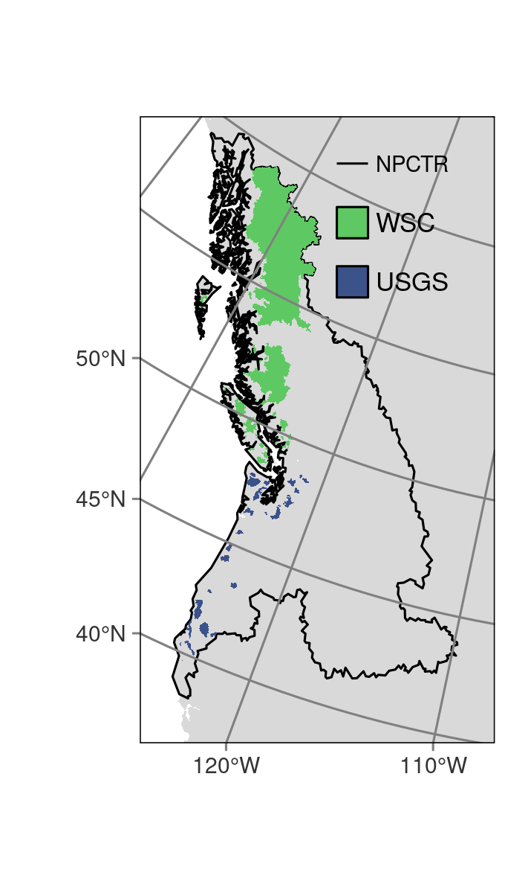
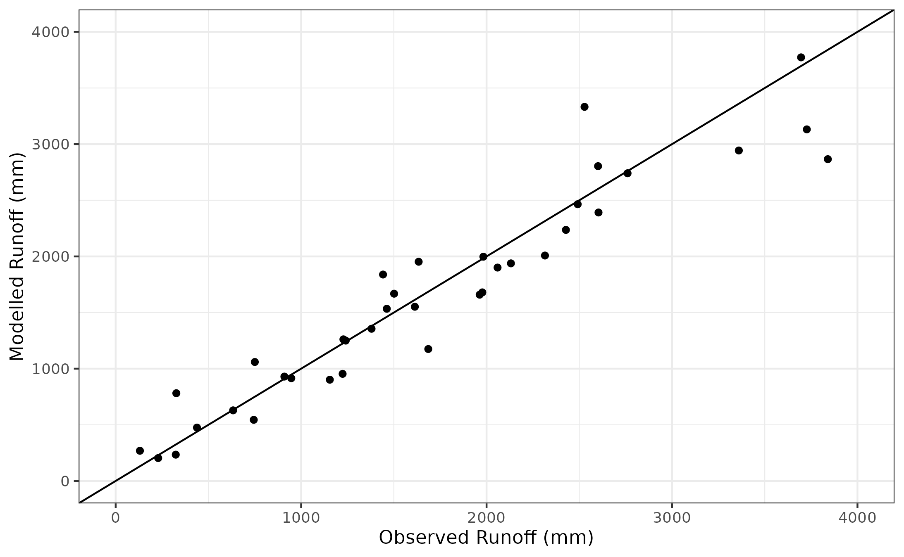

# This repository contains the analysis on the runoff estimates for the DOC paper

Paper title: Small, coastal temperate rainforest watersheds dominate organic carbon transport to the north Pacific Ocean

Authors: G. McNicol, E. Hood, D. E. Butman, S.E. Tank, I.J.W. Giesbrecht, W. Floyd, D. D’Amore, J.B. Fellman, A. Lally, H. McSorely, A. Cebulski

Contents of this repository include

- includes data for the 1981-2020 Q normals modelled using the DCWBM (https://github.com/jwtrubil/DCWBM/tree/research)
- includes scripts to query USGS and WSC gauged data for 1981-2010 
- Comparison plots of modelled versus gauged annual discharge normals and select basin hydrographs
- model vs observed runoff error table 
- scripts to create the composite gauged discharge for each basin of the NPCTR (i.e. includes gauged where available)

